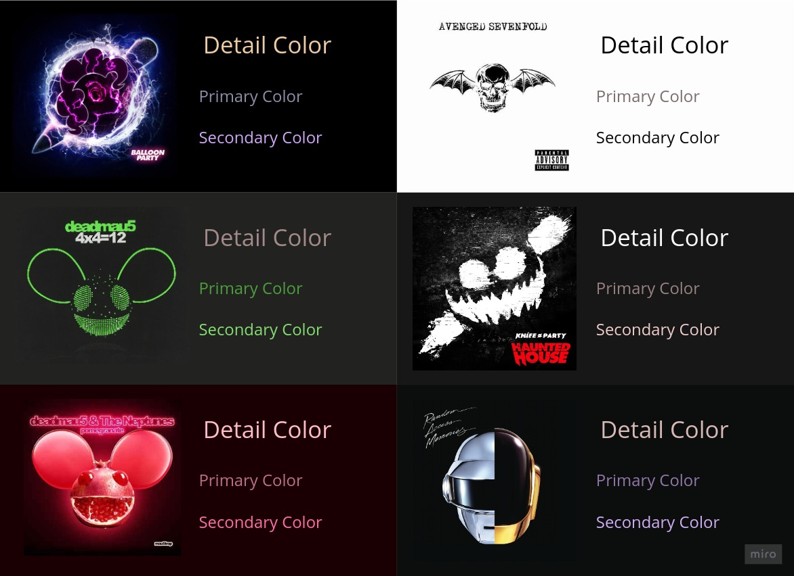

# Colorama

Colorama is a Gem for extracting the most dominant and prominent colors from an image.

## Requirements

This Gem uses `RMagick`, so the ImageMagick lib must be installed.

## Installation

Add this line to your application's Gemfile:

```ruby
gem 'colorama'
```

And then execute:

    $ bundle install

Or install it yourself as:

    $ gem install colorama

## Usage

The simplest usage is extracting the information from the image's file directly:
```ruby
colors = Colorama.extract_from_file('filename')
```

and it returns a `Hash` containing the keys `background`, `primary`, `secondary` and `detail`.

---

You may also pass the level of compression to apply to the image, like so:
```ruby
colors = Colorama.extract_from_file('filename', detail: :high)
```

It accepts `lowest`, `low`, `high` and `highest`

## Examples



## Development

After checking out the repo, run `bin/setup` to install dependencies. Then, run `rake spec` to run the tests. You can also run `bin/console` for an interactive prompt that will allow you to experiment.

To install this gem onto your local machine, run `bundle exec rake install`. To release a new version, update the version number in `version.rb`, and then run `bundle exec rake release`, which will create a git tag for the version, push git commits and the created tag, and push the `.gem` file to [rubygems.org](https://rubygems.org).

## Contributing

Bug reports and pull requests are welcome on GitHub at https://github.com/gustavodiel/colorama. This project is intended to be a safe, welcoming space for collaboration, and contributors are expected to adhere to the [code of conduct](https://github.com/gustavodiel/colorama/blob/master/CODE_OF_CONDUCT.md).

## License

The gem is available as open source under the terms of the [MIT License](https://opensource.org/licenses/MIT).

## Code of Conduct

Everyone interacting in the Colorama project's codebases, issue trackers, chat rooms and mailing lists is expected to follow the [code of conduct](https://github.com/gustavodiel/colorama/blob/master/CODE_OF_CONDUCT.md).
